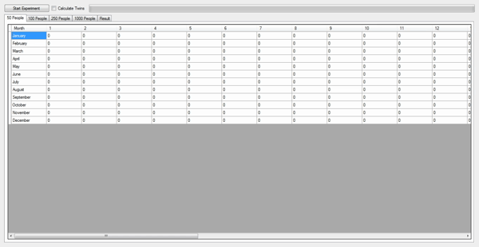

# Birthday Problem

Birthday Problem - 2018 (C#)

The birthday paradox says that the probability that two people in a room will have the same birthday is more than half, provided n, the number of people in the room, is more than 23. This property is not really a paradox, but many people find it surprising.

Birthday Problem doesn't require installation.

<a href="https://github.com/onursert/BirthdayProblem/raw/master/BirthdayProblem.exe">Download Birthday Problem</a>
